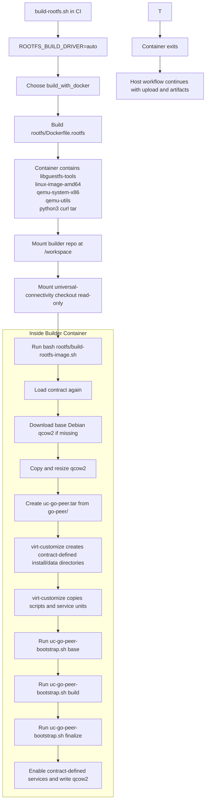
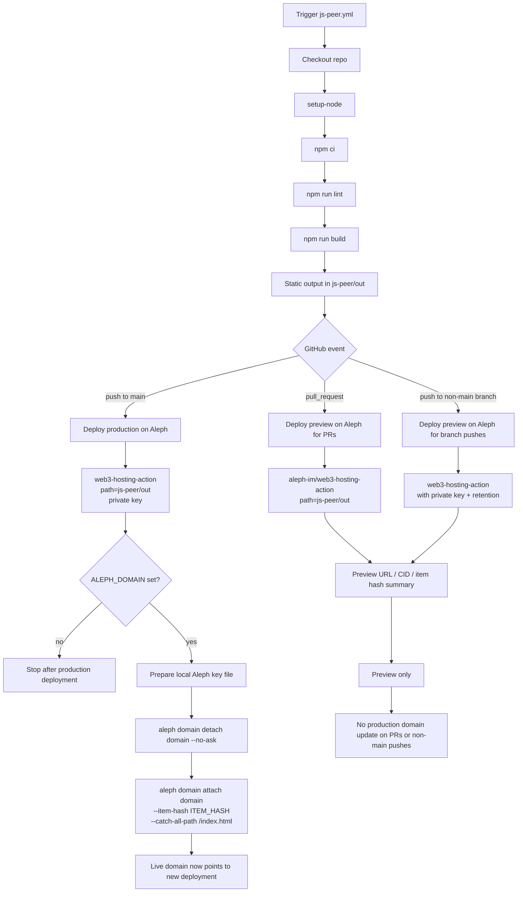

# Relay Rootfs Release Flow

The PWA can now deploy either:

- an Aleph-managed base image such as Ubuntu 22 or Debian 12, or
- a custom qcow2 rootfs referenced by a prebuilt Aleph `STORE` `ItemHash`

This document covers the custom rootfs publishing flow. The browser never
builds or uploads the image itself.

## Profiles

The builder supports four rootfs profiles:

- `py-libp2p` (default): copies the local `py-libp2p` tree and enables `py-libp2p-relay.service`.
- `orbitdb-relay-pinner`: copies a minimal local `orbitdb-relay-pinner` payload and enables `orbitdb-relay-pinner.service` using the upstream `deploy/` files from that repo.
- `uc-go-peer`: copies `go-peer/` from a local `universal-connectivity` checkout, builds the Go relay binary into the image, and enables `uc-go-peer.service`.
- `uc-rust-peer`: copies `rust-peer/` from a local `universal-connectivity` checkout, compiles the Rust peer into the image, and enables `uc-rust-peer.service` plus a local websocket bridge.

By default the builder now uses profile-specific install modes:

- `py-libp2p`: `thin`
- `orbitdb-relay-pinner`: `prebaked`
- `uc-go-peer`: `prebaked`
- `uc-rust-peer`: `prebaked`

`thin` uploads less data to Aleph, but the VM installs runtime packages and
application dependencies on first boot before the relay service becomes
healthy. `prebaked` produces a larger qcow2, but the runtime is already present
inside the image.

## Build

Run the builder from a Linux host with `qemu-img`, `virt-customize`, `tar`,
`curl`, and `aleph-client` available. On macOS, the same command falls back to
a Dockerized Debian/libguestfs builder when `virt-customize` is not installed.

```bash
cd relay-deployer-pwa
rootfs/build-rootfs.sh
```

This builds the default `py-libp2p` image. The script:

1. Downloads a Debian 12 generic cloud image.
2. Copies the selected application tree into the disk image.
3. Installs the matching bootstrap and `systemd` service units.
4. Uploads the finished image to Aleph's IPFS add endpoint and then registers it with `aleph file pin`.
5. Writes `dist-rootfs/rootfs-manifest.json`.
6. When the rootfs contract sets `manifest.copyTarget`, also copies the latest
   and versioned manifest files into that consumer-facing target path.
7. For `uc-go-peer`, the image build uses the contract-defined install, data,
   env, binary, and service paths instead of hardcoded guest paths.

Install mode options:

- `ROOTFS_INSTALL_MODE=thin`: defer runtime package installation and dependency
  setup to first boot.
- `ROOTFS_INSTALL_MODE=prebaked`: keep the older behavior and preinstall
  dependencies into the qcow2 during the build.

To build the alternative OrbitDB relay image from a local checkout:

```bash
cd relay-deployer-pwa
ROOTFS_PROFILE=orbitdb-relay-pinner \
ORBITDB_RELAY_PINNER_DIR=/Users/nandi/orbitdb-relay-pinner \
rootfs/build-rootfs.sh
```

To build the universal-connectivity Rust peer image from a local checkout:

```bash
cd relay-deployer-pwa
ROOTFS_PROFILE=uc-rust-peer \
UNIVERSAL_CONNECTIVITY_DIR=/Users/nandi/Documents/projekte/DecentraSol/universal-connectivity \
rootfs/build-rootfs.sh
```

To build the universal-connectivity Go peer image from a local checkout:

```bash
cd relay-deployer-pwa
ROOTFS_PROFILE=uc-go-peer \
UNIVERSAL_CONNECTIVITY_DIR=/Users/nandi/Documents/projekte/DecentraSol/universal-connectivity \
rootfs/build-rootfs.sh
```

The generated qcow2 filename and the manifest `version` default both change with
`ROOTFS_PROFILE`. For `orbitdb-relay-pinner`, the script derives the default
manifest version from `${ORBITDB_RELAY_PINNER_DIR}/package.json` when that file
is available, and falls back to the built-in default if it cannot read it. Set
`ROOTFS_VERSION=...` to override either behavior explicitly.

## macOS Notes

Homebrew may provide `qemu-img` through `qemu`, but `virt-customize` is a
Linux/libguestfs tool and is not always available as a Homebrew formula. On a
Mac, install and start Docker Desktop, then run the same script. For the
default profile:

```bash
cd relay-deployer-pwa
export ALEPH_BIN=/Users/nandi/Projects/aleph-libp2p-relay/aleph-client/.venv/bin/aleph
rootfs/build-rootfs.sh
```

For the OrbitDB profile, keep the same `ALEPH_BIN` override and also provide the
external checkout path so the Docker builder can mount it read-only:

```bash
cd relay-deployer-pwa
export ALEPH_BIN=/Users/nandi/Projects/aleph-libp2p-relay/aleph-client/.venv/bin/aleph
ROOTFS_PROFILE=orbitdb-relay-pinner \
ORBITDB_RELAY_PINNER_DIR=/Users/nandi/orbitdb-relay-pinner \
rootfs/build-rootfs.sh
```

For the Rust peer profile, mount the full `universal-connectivity` checkout so
the Docker builder can read `rust-peer/`:

```bash
cd relay-deployer-pwa
export ALEPH_BIN=/Users/nandi/Projects/aleph-libp2p-relay/aleph-client/.venv/bin/aleph
ROOTFS_PROFILE=uc-rust-peer \
UNIVERSAL_CONNECTIVITY_DIR=/Users/nandi/Documents/projekte/DecentraSol/universal-connectivity \
rootfs/build-rootfs.sh
```

For the Go peer profile, point at the same checkout and the builder will use
`go-peer/` directly without relying on the upstream Dockerfile:

```bash
cd relay-deployer-pwa
export ALEPH_BIN=/Users/nandi/Projects/aleph-libp2p-relay/aleph-client/.venv/bin/aleph
ROOTFS_PROFILE=uc-go-peer \
UNIVERSAL_CONNECTIVITY_DIR=/Users/nandi/Documents/projekte/DecentraSol/universal-connectivity \
rootfs/build-rootfs.sh
```

The container only builds/customizes the disk image. It runs as `linux/amd64`
because the default base cloud image is Debian amd64. Upload/signing still runs
on the host through `ALEPH_BIN`, so your Aleph account stays in your normal
local client environment.

To build the image without uploading it:

```bash
SKIP_UPLOAD=1 rootfs/build-rootfs.sh
```

To troubleshoot with the older fully baked behavior:

```bash
ROOTFS_INSTALL_MODE=prebaked rootfs/build-rootfs.sh
```

To reuse an already-built qcow2 image and only retry the IPFS/Aleph upload:

```bash
SKIP_BUILD=1 rootfs/build-rootfs.sh
```

If the active rootfs contract sets `manifest.copyTarget`, the builder can sync
the latest and versioned manifest automatically. Otherwise, copy the generated
manifest into `public/rootfs-manifest.json` before building the PWA:

```bash
cp dist-rootfs/rootfs-manifest.json public/rootfs-manifest.json
pnpm build
```

## uc-go-peer Runtime Defaults

The current `uc-go-peer` rootfs flow assumes:

- public proxy entrypoint on `443` when a proxy hostname is configured
- native listener ports:
  - TCP: `9095`
  - WS backend: `9096`
  - AutoTLS WSS: `9097`
- contract-driven guest paths for:
  - install dir
  - data dir
  - env file
  - binary path
  - bootstrap/main/autotls service names

`read-rootfs-contract.py` now exports those paths and service names, and
`build-rootfs-image.sh` uses them for the `uc-go-peer` image instead of relying
on fixed `/opt/go-peer`-style paths.

The temporary setup server inside the guest also exposes:

- `POST /configure` to write the mapped-address runtime config
- `GET /health` to report readiness and metadata generation state
- `GET /metadata` to return the describe payload once the relay has started and
  its announced/bootstrap addresses can be summarized

## Flow Diagrams

### Go Relay Rootfs Creation And Aleph Publish

```mermaid
flowchart TD
    A[Workflow dispatch<br/>build-aleph-go-peer-rootfs.yml] --> B[Checkout universal-connectivity]
    B --> C[Read uc-go-peer rootfs contract]
    C --> D[Export contract-derived env<br/>ROOTFS_PROFILE<br/>ROOTFS_INSTALL_MODE<br/>ROOTFS_CONTRACT_FILE]
    D --> E[Checkout rootfs builder repo<br/>NiKrause/aleph-libp2p-relay]
    E --> F[Install build dependencies]
    F --> G{publish=true?}
    G -- no --> H[Skip Aleph client/account setup]
    G -- yes --> I[Install aleph-client]
    I --> J[Write ~/.aleph-im/config.json<br/>and ~/.aleph-im/private-keys/aleph-vm.key]
    H --> K[Run relay-deployer-pwa/rootfs/build-rootfs.sh]
    J --> K
    K --> L[Load contract with read-rootfs-contract.py]
    L --> M[Select profile uc-go-peer<br/>and install mode prebaked]
    M --> N{Builder driver}
    N -->|CI| O[Use Dockerized Debian/libguestfs builder]
    N -->|local Linux| P[Use host virt-customize path]
    O --> Q[Run build-rootfs-image.sh]
    P --> Q
    Q --> R[Download Debian cloud image]
    R --> S[Resize qcow2]
    S --> T[Tar universal-connectivity/go-peer<br/>into dist-rootfs/uc-go-peer.tar]
    T --> U[virt-customize copies scripts/services<br/>and runs bootstrap base/build/finalize]
    U --> V[Emit aleph-uc-go-peer.qcow2]
    V --> W{publish=true?}
    W -- no --> X[Write local artifacts only]
    W -- yes --> Y[Upload qcow2 to Aleph IPFS add endpoint]
    Y --> Z[Extract CID]
    Z --> AA[aleph file pin CID]
    AA --> AB[Extract rootfs item hash]
    X --> AC[Write rootfs-manifest.json]
    AB --> AC
    AC --> AD[Upload workflow artifacts<br/>qcow2/manifest/json logs]
```



### What Happens Inside Docker In CI



### js-peer Build, Aleph Publish, And Domain Linking



## Runtime Defaults

### `py-libp2p`

- Relay TCP port: `4001`
- Relay seed: unset by default
- Service name: `py-libp2p-relay`
- Install directory: `/opt/py-libp2p`
- Bootstrap service: `py-libp2p-relay-bootstrap`
- Bootstrap stamp: `/var/lib/py-libp2p-relay/bootstrap-complete`

### `orbitdb-relay-pinner`

- Metrics/health port: `9090`
- Temporary setup endpoint: `80`
- Public HTTPS/WSS proxy port: `443`
- Relay TCP/WS/WebRTC/QUIC ports: `9091`, `9092`, `9093`, `9094`
- Service name: `orbitdb-relay-pinner`
- Install directory: `/opt/orbitdb-relay-pinner`
- Environment file: `/etc/default/orbitdb-relay-pinner`
- Data directory: `/var/lib/orbitdb-relay-pinner`
- Configure helper: `/usr/local/sbin/orbitdb-relay-pinner-configure.sh`
- Setup endpoint service: `orbitdb-relay-pinner-bootstrap.service`
- Ready file: `/etc/default/orbitdb-relay-pinner.ready`

The OrbitDB profile copies the upstream `deploy/orbitdb-relay-pinner.service`
and `deploy/orbitdb-relay-pinner.env.example` from the source checkout into the
image, installs Node.js 22, Caddy, and production dependencies during the
image build, and leaves the relay service enabled but gated by
`/etc/default/orbitdb-relay-pinner.ready`.
It does not try to guess the final public IP or host-mapped Aleph ports inside
the rootfs build.

Instead, the image boots a temporary HTTP setup endpoint on internal port `80`
via `orbitdb-relay-pinner-bootstrap.service`. Once Aleph has assigned the
external host port mappings, the PWA posts them to `http://HOST_IP:HOST_PORT/configure`.
That endpoint runs:

```bash
/usr/local/sbin/orbitdb-relay-pinner-configure.sh \
  --public-ipv4 PUBLIC_IP \
  [--public-ipv6 PUBLIC_IPV6] \
  --tcp-port HOST_TCP_PORT \
  --ws-port HOST_WS_PORT \
  [--proxy-hostname PROXY_HOSTNAME] \
  [--metrics-port HOST_METRICS_PORT] \
  --webrtc-port HOST_WEBRTC_PORT \
  --quic-port HOST_QUIC_PORT
```

After a successful configure call it writes `VITE_APPEND_ANNOUNCE`, creates the
ready file, persists external relay/metrics host port mapping values in
`/etc/default/orbitdb-relay-pinner`, starts the relay with the prebaked runtime,
and shuts the temporary HTTP endpoint down. When a proxy hostname is passed in,
the configure step appends secure `/dns4/.../tls/ws` and `/dns6/.../tls/ws`
multiaddrs for that hostname, writes `/etc/caddy/Caddyfile`, and starts a local
Caddy instance to terminate HTTPS/WSS in front of the relay's internal `9092`
WebSocket listener. The secure
`/tls/ws` suffix is still intentional here: it describes the externally
reachable transport exposed by Caddy, even though relay-side AutoTLS is
disabled.

### Operational Notes

- `orbitdb-relay-pinner.service` is gated by
  `/etc/default/orbitdb-relay-pinner.ready`
- `orbitdb-relay-pinner-bootstrap.service` is only the temporary setup server
- `caddy.service` is gated by `/etc/default/orbitdb-relay-pinner.caddy-ready`
- if the bootstrap service is active and the relay service is skipped because of
  `ConditionPathExists=/etc/default/orbitdb-relay-pinner.ready`, the relay has
  not been configured yet

Expected listening ports after a successful configure step:

- `9090/TCP` metrics and health API
- `9091/TCP` relay TCP
- `9092/TCP` relay WebSocket backend for the local HTTPS proxy
- `443/TCP` local HTTPS/WSS proxy
- `9093/UDP` WebRTC-direct
- `9094/UDP` QUIC

To verify the live VM after configure:

```bash
systemctl status orbitdb-relay-pinner orbitdb-relay-pinner-bootstrap caddy --no-pager -l
ss -ltnup | grep -E ':(443|9090|9091|9092|9093|9094)\b' || true
```

Logs go to `journald`, not to a dedicated file:

```bash
journalctl -u orbitdb-relay-pinner -n 200 --no-pager
```

If the external mapped setup port is flaky or inaccessible, you can always test
the setup server locally from inside the VM:

```bash
curl -v http://127.0.0.1/health
curl -v -X POST http://127.0.0.1/configure \
  -H 'content-type: application/json' \
  --data '{"public_ipv4":"PUBLIC_IP","public_ipv6":"PUBLIC_IPV6","tcp_port":TCP_PORT,"ws_port":WS_PORT,"proxy_url":"https://PROXY_HOSTNAME","metrics_port":METRICS_PORT,"webrtc_port":WEBRTC_PORT,"quic_port":QUIC_PORT}'
```

That local success proves the image build and configure helper are working even
if browser-to-CRN reachability for the temporary external setup port is not.
Once configured, you can verify the persisted external secure announce entries:

```bash
curl -sS http://127.0.0.1:9090/multiaddrs
grep '^VITE_APPEND_ANNOUNCE=' /etc/default/orbitdb-relay-pinner
sed -n '1,160p' /etc/caddy/Caddyfile
```

The persisted secure WebSocket announce uses the configured proxy hostname and
Aleph's standard HTTPS proxy port `443`. These secure multiaddrs point at the
Caddy front door, not at relay-side AutoTLS, for example:

```text
/dns4/PROXY_HOSTNAME/tcp/443/tls/ws
/dns6/PROXY_HOSTNAME/tcp/443/tls/ws
```

### `uc-rust-peer`

- Temporary setup endpoint: `80`
- Public HTTPS/WSS proxy port: `443`
- Relay TCP/WebSocket/WebRTC/QUIC ports: `9092`, `9093`, `9090`, `9091`
- Service names: `uc-rust-peer`, `uc-rust-peer-ws-bridge`
- Install directory: `/opt/rust-peer`
- Environment file: `/etc/default/uc-rust-peer`
- Data directory: `/var/lib/uc-rust-peer`
- Configure helper: `/usr/local/sbin/uc-rust-peer-configure.sh`
- Setup endpoint service: `uc-rust-peer-bootstrap.service`
- Ready file: `/etc/default/uc-rust-peer.ready`

This profile uses the same first-boot configure pattern as OrbitDB. The image
boots a temporary HTTP setup endpoint on internal `80`, the PWA posts the
mapped Aleph host ports, and the configure helper starts the real services only
after those mappings are known.

After configure:

- `uc-rust-peer.service` runs the upstream `rust-peer` in `--headless`
  relay-server mode
- `uc-rust-peer-ws-bridge.service` accepts websocket connections on internal
  `9093` and forwards the byte stream to the Rust peer TCP listener on `9092`
- when a proxy hostname is available, Caddy terminates HTTPS/WSS on `443` and
  forwards to that local websocket bridge

Important caveat: the current upstream `rust-peer` codebase still does not
natively advertise host-remapped websocket multiaddrs. This image therefore
stores the computed external websocket addresses in `RUST_PEER_ANNOUNCE_HINTS`
for operators and browser clients, and browser-side relay configuration should
prefer explicit multiaddrs when using the `443` WSS proxy path.

### `uc-go-peer`

- Temporary setup endpoint: `80`
- Optional public HTTPS/WSS proxy port: `443`
- Native relay listener ports:
  - TCP: `9095`
  - WS backend: `9096`
  - native AutoTLS WSS: `9097`
- Service name: `uc-go-peer`
- AutoTLS refresh service: `uc-go-peer-autotls-refresh`
- Install directory: contract-defined, currently `/opt/go-peer`
- Environment file: contract-defined, currently `/etc/default/uc-go-peer`
- Data directory: contract-defined, currently `/var/lib/uc-go-peer`
- Binary path: contract-defined, currently `/usr/local/bin/universal-chat-go`
- Configure helper: `/usr/local/sbin/uc-go-peer-configure.sh`
- Setup endpoint service: `uc-go-peer-bootstrap.service`
- Ready file: `/etc/default/uc-go-peer.ready`

This profile also uses the first-boot configure pattern. The image starts a
temporary HTTP setup endpoint on internal `80`, the PWA posts the mapped Aleph
host ports, and the configure helper writes `LIBP2P_ANNOUNCE_ADDRS` so the
running Go relay announces the actual externally reachable TCP, WSS, QUIC,
WebTransport, and WebRTC addresses.

Unlike the OrbitDB profile, `uc-go-peer` keeps native AutoTLS-enabled WSS on
its mapped `9097` host port, while the plain websocket backend stays on
internal `9096`. A post-start AutoTLS refresh step then reads the exact
`libp2p.direct` hostname from the running service logs, replaces the wildcard
placeholder announce entries with that concrete secure hostname, and, when a
proxy hostname is available, can also keep an additional `443`-based
`/dns4|/dns6/.../tls/ws` path in front of the native AutoTLS WSS backend.

The rootfs build path for `uc-go-peer` is now more contract-driven than before:

- `read-rootfs-contract.py` exports `binaryPath`, `manifest.copyTarget`, and
  the contract service names
- `build-rootfs-image.sh` uses the contract-defined install path, data path,
  env file, service names, and binary path
- `build-rootfs.sh` can copy the generated manifest back into the
  contract-declared consumer path

## First-Boot Requirements

Thin images require outbound network access on first boot:

- `py-libp2p` installs Python, build dependencies, and the virtualenv on boot.

Expect the first boot to take noticeably longer than subsequent reboots. Use
`journalctl -u py-libp2p-relay-bootstrap` or
`journalctl -u orbitdb-relay-pinner` to troubleshoot relay startup failures.

The image must stay public and reproducible. Do not bake wallet keys, tokens,
private SSH keys, API credentials, or user-specific configuration into it.
